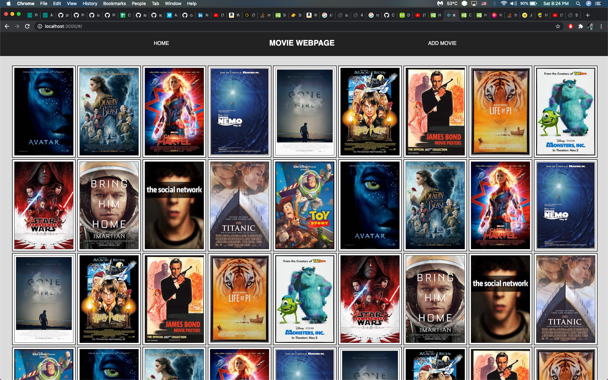
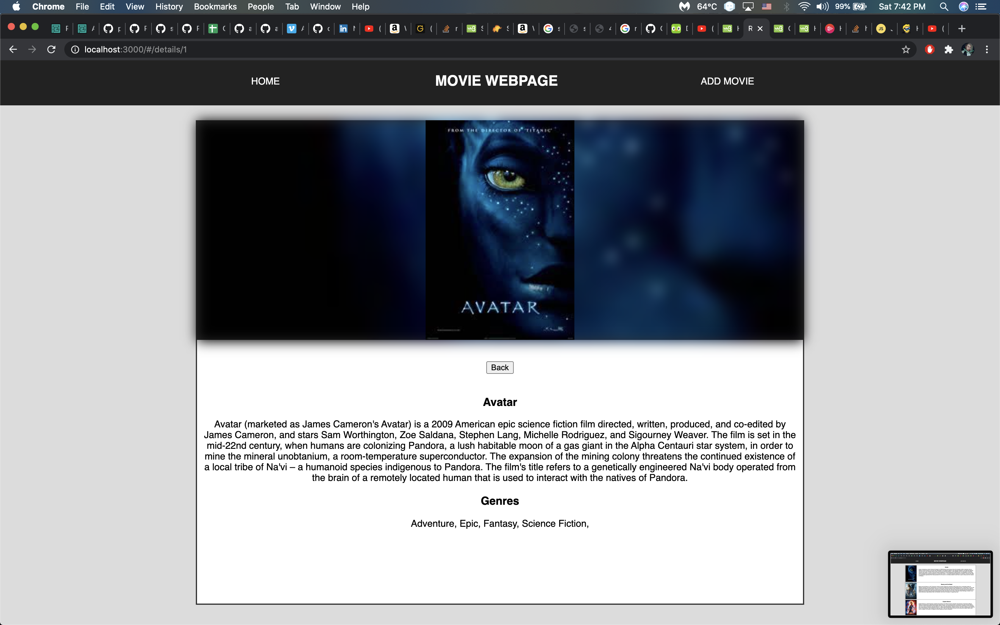
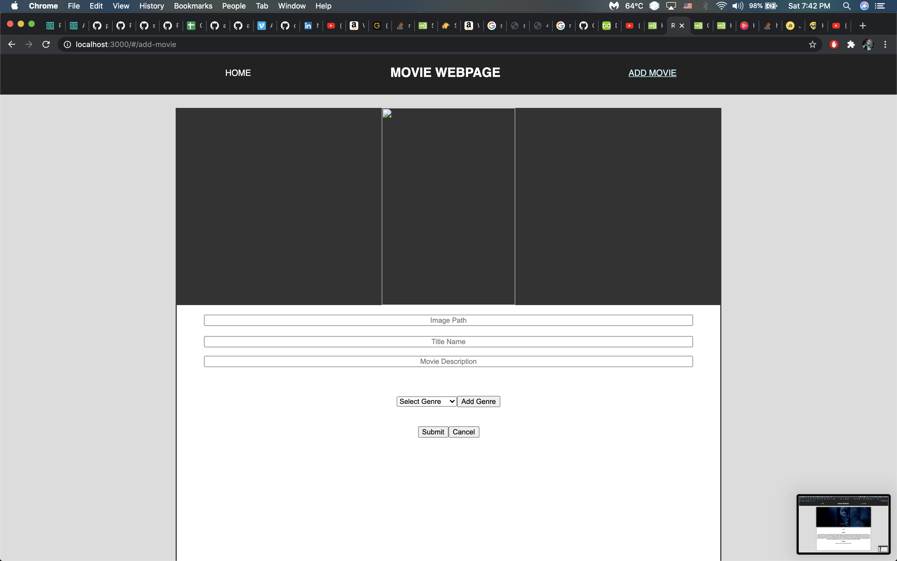

# WEEKEND MOVIE SAGA

## Description

Time : 23 hours

This is a project is a catalog for movies. information such as movie name, picture and basic description will be store. movies can also be added to the catalog via the add-movie form.

## Screen Shot

## Database Setup

1. Create a database named `saga_movies_weekend`
2. Run the queries from `database.sql` on the `saga_movies_weekend` database.

## Install Dependencies

1. `npm install`
2. `npm run server`
3. `npm run client`

## Usage

1. Select through the catalog of movies to get their information
2. Clicking on a movie will bring up more details about the movie
3. Expanding the catalog is also possible via the Add Movies link on the navigation bar

## Built With

1. Axios
2. React
3. Redux
4. PostgreSQL
5. Node
6. Express
7. Saga

## License

[MIT](https://choosealicense.com/licenses/mit/)

_Note, include this only if you have a license file. GitHub will generate one for you if you want!_

## Acknowledgement

Thanks to [Prime Digital Academy](www.primeacademy.io) who equipped and helped me to make this application a reality. (Thank your people)

## Support

If you have suggestions or issues, please email me at [csim6890@gmail.com](www.google.com)
